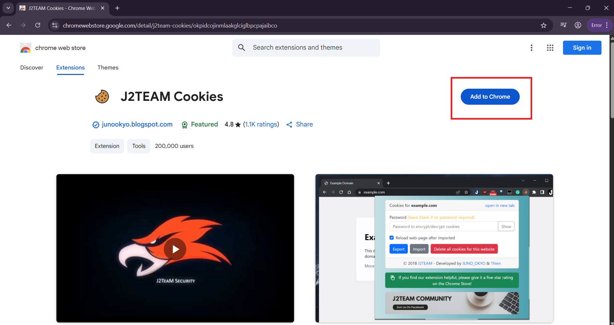
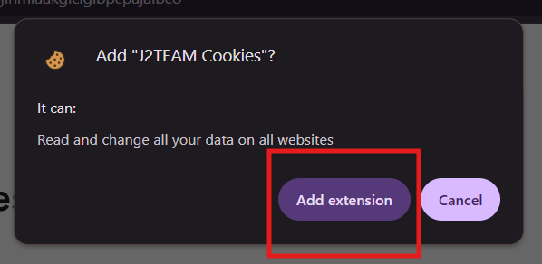
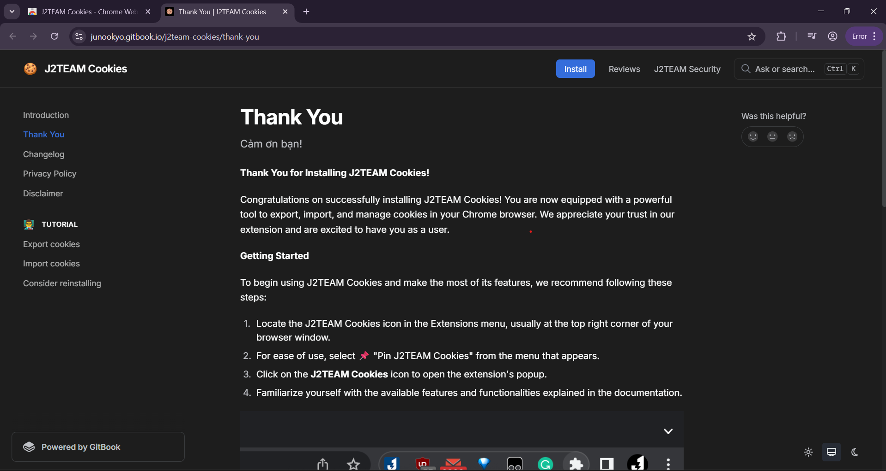
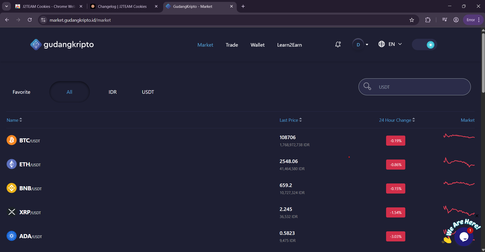
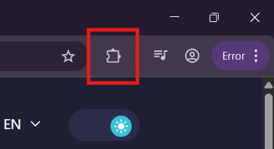
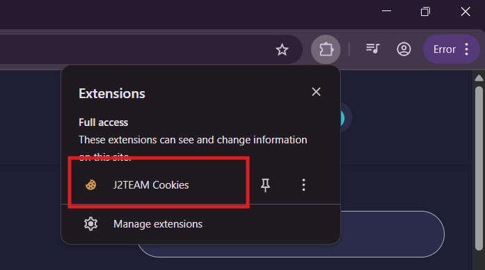
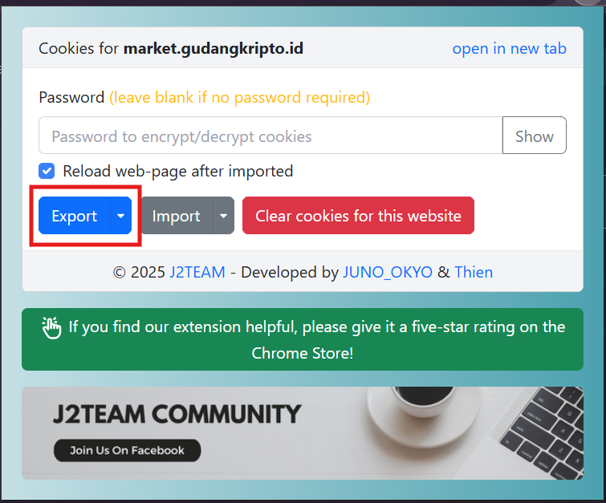
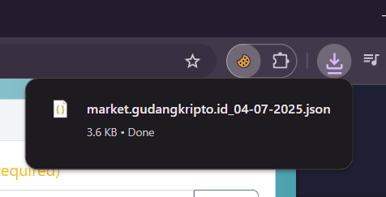

# 📄 Panduan Ekspor Cookies Menggunakan Ekstensi Chrome (J2TEAM Cookies)

Panduan ini akan membimbing Anda untuk mengunduh dan menggunakan ekstensi Chrome bernama **J2TEAM Cookies** guna mengekspor data cookie dari situs <a href="https://market.gudangkripto.id" target="_blank">market.gudangkripto.id</a>.

---

## 🧩 Langkah 1: Instalasi Ekstensi Chrome

Silakan instal ekstensi **J2TEAM Cookies** melalui _**link**_ berikut:

- 🌐 <a href="https://chromewebstore.google.com/detail/j2team-cookies/okpidcojinmlaakglciglbpcpajaibco" target="_blank">_Link Resmi Chrome Web Store_</a>

atau Copy dan Paste di Browser

```plaintext
https://chromewebstore.google.com/detail/j2team-cookies/okpidcojinmlaakglciglbpcpajaibco
```

Berikut langkah-langkahnya:

1. Klik _**link**_ di atas untuk membuka halaman Chrome Web Store dari J2TEAM Cookies.
   <p align="center"></p>

2. Setelah halaman terbuka, klik tombol **Add Extensions** / **Tambahkan Ekstensi**.
   <p align="left"></p>

3. Setelah ekstensi berhasil ditambahkan, Anda akan melihat halaman seperti berikut:
   <p align="center"></p>

Setelah proses instalasi selesai, ikon ekstensi akan muncul di pojok kanan atas browser Chrome Anda.

---

## 🔐 Langkah 2: Login ke GudangKripto

1. Buka _**link**_ <a href="https://market.gudangkripto.id/auth/login" target="_blank">https://market.gudangkripto.id/auth/login</a>.
2. Login menggunakan **Username** dan **Password** Anda seperti biasa.
3. Selesaikan verifikasi slider.
4. Masukkan **OTP** jika diminta.

Setelah berhasil login, Anda akan diarahkan ke halaman utama dashboard GudangKripto.

<p align="center"></p>

---

## 🍪 Langkah 3: Ekspor Cookie Menggunakan J2TEAM Cookies

1. Klik ikon **Extensions** (ikon puzzle) di pojok kanan atas Chrome.
   <p align="left"></p>

2. Cari dan klik pada ekstensi **J2TEAM Cookies**.
   <p align="left"></p>

3. Pilih opsi **Export**.
   <p align="left"></p>

4. File `.json` akan otomatis diunduh oleh browser.
   <p align="left"></p>

> 💡 _Tips:_ Jika file tidak otomatis terunduh, periksa pengaturan unduhan atau popup blocker di browser Anda.

---

## 📝 Langkah 4: Ubah nama File

Setelah file `.json` berhasil diunduh, ubah namanya menggunakan **nama lengkap Anda** agar mudah dikenali saat dikumpulkan.

Contoh format nama:

```plaintext
cookies_mulyono.json
```

## 📤 Langkah 5: Kirim File

Setelah file Anda siap dan sudah di-rename, silakan kirim file nya ke tim teknis

---

## ⚠️ Catatan Keamanan

Cookies mengandung informasi sesi login yang **sangat sensitif**. Maka dari itu:

- ❗ **Jangan membagikan file cookies ke pihak lain**, selain untuk keperluan resmi.
- 🔐 File cookies **hanya digunakan oleh tim teknis** untuk proses integrasi sistem.

🙏 Terima kasih atas partisipasinya dan kerahasiaannya!
